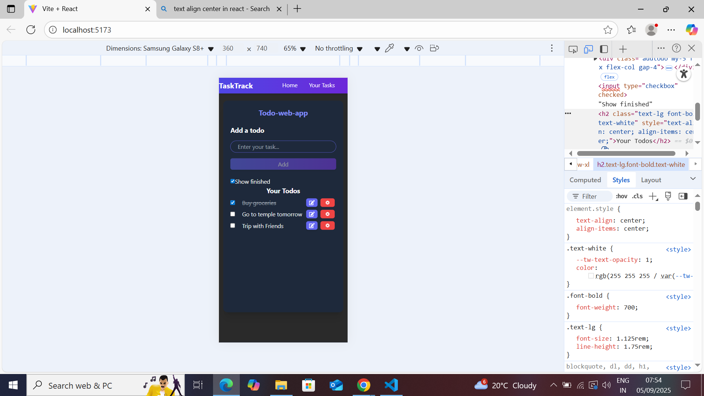

# React TODO App

A simple yet polished TODO list application built with React. Inspired by a **Code With Harry** tutorial, but **enhanced with my own styling, improved UX, and new features**.

## Table of Contents

- [About the Project](#about-the-project)  
- [Built With](#built-with)  
- [Getting Started](#getting-started)  
  - [Prerequisites](#prerequisites)  
  - [Installation](#installation)  
  - [Running Locally](#running-locally)  
- [Usage](#usage)  
- [Features & Enhancements](#features--enhancements)  
- [What I Learned](#what-i-learned)  
- [Acknowledgements](#acknowledgements)  
- [Roadmap](#roadmap)  
- [License](#license)

---

## About the Project

This TODO app started with a tutorial from **Code With Harry**, which helped me grasp the fundamentals of React. Once the core functionality was in place, I added my own styling and enhancements to make it visually distinct and more user-friendly.

## Technologies Used

| Technology       | Purpose                               |
|------------------|----------------------------------------|
| React            | UI and component management            |
| Tailwind CSS     | Styling and design                    |
| localStorage     | Data persistence across page reloads  |


## Getting Started


### Prerequisites

Make sure you have the following installed on your machine:

- [Node.js](https://nodejs.org/) (v14 or later)  
- npm (bundled with Node.js) or yarn

### Installation

1. Clone this repository:
   ```bash
   git clone https://github.com/Kartikbilagi23/react-todo-app.git
   cd react-todo-app
